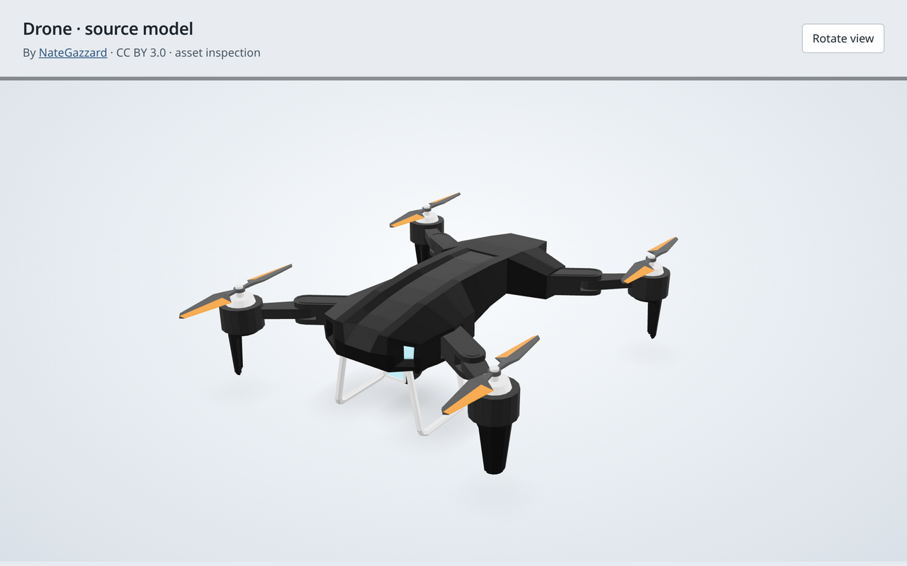

# Drone model

`drone.glb` is [Drone by NateGazzard](https://poly.pizza/m/DNbUoMtG3H), licensed
under [Creative Commons Attribution 3.0 Unported](../../LICENSES/DRONE-CC-BY-3.0.txt).
Retain this attribution when distributing the model or a rendered example.
The retained text comes from the SPDX license list. The
[Creative Commons license page](https://creativecommons.org/licenses/by/3.0/)
provides the controlling license and its summary.

The file was retrieved from
[pixelscript/edgetx-log-viewer](https://github.com/pixelscript/edgetx-log-viewer/blob/38304698d39039c0239fc3567eab205455aa8b69/public/models/Drone.glb).
That revision's README also names NateGazzard and the CC BY 3.0 license.
This repository stores the mirror's bytes unchanged.

SHA-256: `bc9f0d765e0fdb838a9baf26b472f955a11bb2509a3337e918054241b134638d`.
The file contains 4,564 triangles, six mesh nodes, one palette texture, and no animations.

## Physics alignment

The source model faces +Z with +Y up. Subtract its body bounding-box centre
`(0.0000705, -0.055414, -0.1340265)` metres, then rotate 180 degrees around +Y.
The simulation uses +X right, +Y up, and -Z forward. Keep the model at unit scale.

Map action indices to `Rotor_FL`, `Rotor_FR`, `Rotor_BR`, and `Rotor_BL`, in that order.
The motor centres relative to the body are approximately 0.2505 metres to either
side, 0.0875 metres above, and 0.2606 metres forward or behind.
The physics box uses half-extents `(0.287, 0.104, 0.297)` metres.
It approximates the body and landing legs; it does not collide individual rotor blades.

Rotor vertices already include their offsets from the source origin.
Before animating a rotor, create a pivot at that rotor's centre and preserve its
initial world position. Rotating the mesh around the source origin would move
the whole rotor around the drone.
