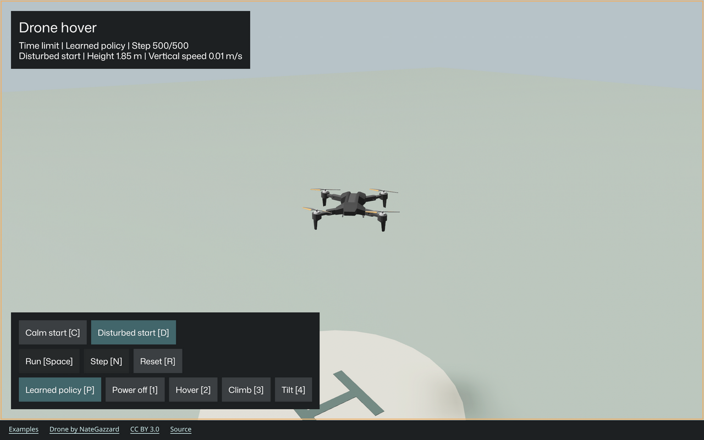

# Watching learned drone recovery

Status: native tests and browser inference verified, 2026-10-08.

The viewer loads the qualified recovery checkpoint and runs its mean action
through the same validated motor boundary as the training lesson. The library
API is unchanged. Browser training controls remain unfinished.

## Run the comparison

```sh
nix develop --command cargo run --features robots --example drone-flight
```

Use the [browser build guide](../robot-web/README.md) for WebAssembly.

1. Select Disturbed start.
2. Select Learned policy.
3. Select Run.
4. Select Reset after the ten-second episode.
5. Select Hover, then Run, to compare constant half-thrust.

Both controllers begin with seed 42. The learned policy reaches the 500-action
time limit. Constant half-thrust reaches the ground during action 274.
Reset keeps learned weights and clears their recurrent memory. Start selection
also retains a learned controller. Manual reset restores the hover command.

The [19-second recording](progress/drone-inference.mp4) shows learned recovery,
reset, a single step, and the manual comparison. The
[contact sheet](progress/drone-inference-contact-sheet.png) samples sixteen frames.



## Invariants

- Controller state is manual with one motor preset, learned with policy and memory,
  or failed with a diagnostic. These states are mutually exclusive.
- Playback is paused or running. Physics advances only while the episode continues
  and the controller can produce a valid action.
- Policy output must contain four finite fractions in inclusive `[0, 1]`.
  A load or inference failure pauses playback before physics can advance.
- Reset preserves learned weights and clears memory. Reset restores the selected
  start profile and seed 42. Manual reset restores the hover command.
- Selecting a start profile resets the episode and preserves a learned controller.
  Selecting a manual preset replaces the controller without advancing physics.
- Rotor animation uses the last applied command. Observation, completion, and step
  count remain consequences of the environment, never independently editable state.

Inference borrows the policy and observation, then owns its next recurrent memory.
Each action uses the fixed 12-input, 32-unit network. Retained state is bounded by
the model and one episode; the viewer does not retain a trajectory.

## Acceptance checklist

- [x] Record a failing session test before implementation.
- [x] Share the existing model recipe and observation encoding with the viewer.
- [x] Verify 500-step disturbed recovery, deterministic reset, and controller changes.
- [x] Verify invalid checkpoints and actions cannot advance physics.
- [x] Exercise policy buttons, shortcuts, state text, and disabled controls.
- [x] Run formatting, root tests, focused tests, strict Clippy, and personal lints.
- [x] Measure changed-source coverage and record any remaining gaps.
- [x] Build WASM and inspect desktop and narrow layouts in the T3 browser.
- [x] Show a screenshot and video of learned recovery and reset.

## Verification limits

All 25 viewer tests pass. The ten learning tests still pass after extracting the
[shared model recipe](../examples/robots/learning/model.rs). The original failing
test reported missing session methods before implementation.

[Coverage](progress/drone-inference-coverage.json) records 292/292 instrumented
changed lines, including internal tests. The controller and session have full
measured line and branch coverage. Unchanged graphics initialization and UI asset
state/color projection retain gaps. Browser interaction does not supply native
coverage hits.

The strict personal lint gate still fails on 51 existing library errors; Dylint
retains two existing warnings. A separate discovery pass keeps warnings enabled
without promoting them to errors, allowing it to reach the viewer. That pass
reports no viewer diagnostics. It does not make the strict gate pass.

The optimized WASM is 36,444,646 bytes; local gzip level 9 produces 11,133,806 bytes.
These are file sizes, not measured network transfers. Desktop and
[390-pixel frame layouts](progress/drone-inference-narrow.png) were inspected.
Native window interaction and mobile device/touch input remain unverified.
The preview advances continuously during recording; idle preview wall-clock speed
has not been qualified.
