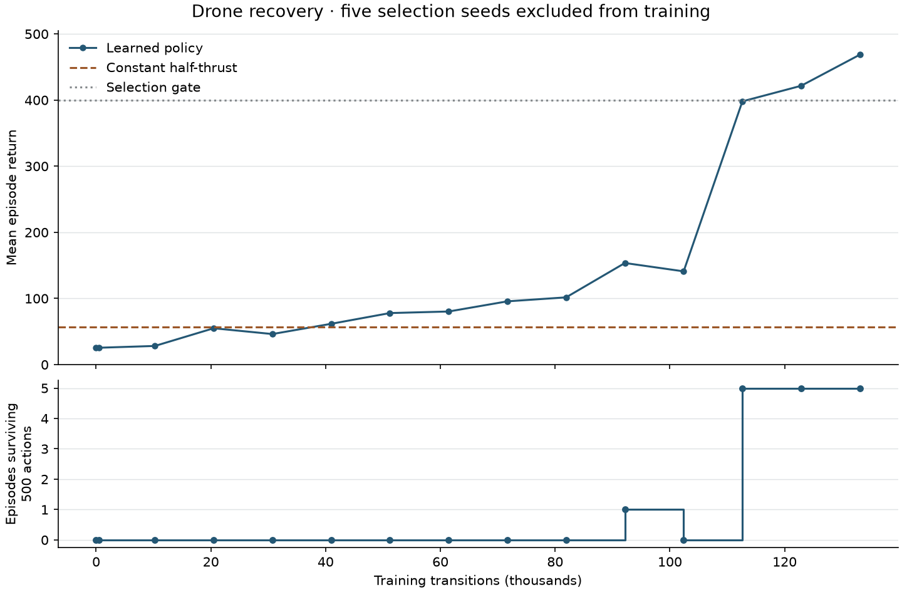

# Learning drone recovery

Status: trained checkpoint qualified on native and browser tests, 2026-10-08.

The [training guide](../examples/robots/train.rs) trains the existing recurrent PPO
implementation on `DroneHover::disturbed()`. Its support code stays beside the
examples; the library API remains unchanged. The visual viewer now offers the
bundled policy alongside manual controls. Browser training controls are next.

## Run the lesson

```sh
nix develop --command cargo run --no-default-features --features robots --example drone-train
```

The default recipe uses seed 7, eight environments, 64 actions per environment,
and 260 updates. It writes evaluations and checkpoints under `runs/drone-recovery`.
Use a separate `--output` directory to preserve an earlier run. An existing output
directory is reused, and files with the same step count are replaced.

Run one optimizer update to inspect the workflow:

```sh
nix develop --command cargo run --no-default-features --features robots --example drone-train -- --updates 1 --output runs/drone-smoke
```

The actor has 32 recurrent units; the critic has two 64-unit hidden layers.
Actor and critic learning rates are 0.0003 and 0.001. Each rollout receives four
PPO epochs with eight sequences per minibatch. Discount is 0.995, GAE decay is
0.95, initial log standard deviation is -2, and entropy coefficient is 0.001.
The [recipe](../examples/robots/learning/model.rs) records the remaining defaults.

## Recorded result

The selected checkpoint used 133,120 training transitions. It survived all five
selection episodes with mean return 468.670 and mean final target distance 0.255 m.
On the separate 32 final seeds, it survived every ten-second episode, with mean
return 443.324 and mean final target distance 0.341 m. Constant half-thrust survived
none of those final episodes and scored 47.621.



The [curve data](progress/drone-learning-curve.json),
[selection result](progress/drone-learning-selection.json), and
[final results](progress/drone-learning-final.json) retain the measurements.
[The checkpoint](../assets/robots/recovery.mpk) uses Burn 0.21 full-precision
MessagePack weights for the actor and critic. No demonstrations or scripted
controller supplied its actions. Qualification does not establish reliability
across multiple independent training runs.

The browser runs the same qualification assertions against the bundled checkpoint.
The [browser screenshot](progress/drone-learning-browser.png) shows all ten tests
passing, including optimization, checkpoint reload, and held-out recovery.
The [inference guide](DRONE_INFERENCE.md) adds a learned-flight recording and
compares the policy with constant half-thrust from the same disturbed start.

## Invariants

- The environment retains typed observations and validated four-motor actions.
  Decode policy outputs before stepping physics. Reject incorrect width, non-finite
  values, and fractions outside inclusive `[0, 1]`.
- Encode target displacement, world up, linear velocity, and angular velocity in
  the body frame. Divide displacement by 2 metres, velocity by 2 m/s, and angular
  velocity by 2 rad/s. The resulting twelve inputs are dimensionless.
- Every lane owns one environment, observation, action sampler, episode counter,
  and recurrent memory. Preserve memory across rollout boundaries; reset it only
  when the episode ends. Store the initial memory of every optimization sequence.
- Sequences stop before reset. Natural termination disables value bootstrapping.
  Time-limit truncation bootstraps from the final observation before reset.
- Training seeds have their highest bit clear and bit 10 set. Selection seeds are
  `0`, `1`, `2`, `42`, and `u64::MAX`. Final qualification uses distinct high-bit
  seeds. Training cannot consume either evaluation set.
- Optimize the documented environment reward. Report unscaled returns, survival,
  and target distance. No scripted controller or demonstration initializes the actor.
- Keep file output and command-line parsing in the native guide. Shared collection,
  inference, and optimization must compile for browser training.

The collector retains one bounded rollout per update. Its time and storage grow
linearly with lanes times rollout length. Network snapshots and rollout buffers
own their data because optimization outlives the sampled environment step.

## Sources and local choices

[OpenAI's pinned PPO implementation](https://github.com/openai/spinningup/blob/038665d62d569055401d91856abb287263096178/spinup/algos/pytorch/ppo/ppo.py)
collects trajectories before optimization and bootstraps at rollout cutoffs.
[Gymnasium's time-limit guide](https://gymnasium.farama.org/tutorials/gymnasium_basics/handling_time_limits/)
requires a value estimate after truncation and omits it after termination.
This lesson follows those boundary rules with the repository's existing recurrent
PPO optimizer. It does not claim identical networks or hyperparameters.

The [pinned PyBullet drone guide](https://github.com/learnsyslab/gym-pybullet-drones/blob/7ebad1ecabd28a7000add2d05f888aa2e837c2cc/gym_pybullet_drones/examples/learn.py)
separates PPO training, deterministic evaluation, and saved-model replay.
This lesson directly commands four motor forces; the upstream guide defaults to
one-dimensional RPM control. Its training budget is not evidence for this task.

## Qualification

Select a checkpoint using the five selection seeds only. Require all five episodes
to survive 500 actions and their mean return to reach 400 before final evaluation.
Prefer the highest mean selection return; break ties using the earlier checkpoint.

Final evaluation uses seeds `u64::MAX - 1` through `u64::MAX - 32`, inclusive.
Require at least 30 of 32 episodes to reach the ten-second limit, mean unscaled
return of at least 400, and mean final target distance of at most 0.5 metres.
These gates qualify this hover lesson. They do not qualify damage recovery,
perception, pursuit, or performance beyond ten seconds.

## Acceptance checklist

- [x] Record failing integration tests and a runnable guide before implementation.
- [x] Test encoding, action rejection, seed separation, episode boundaries, and GAE.
- [x] Collect deterministic bounded batches and perform a real optimizer update.
- [x] Verify saved and loaded policies reproduce actions.
- [x] Train and retain metrics, configuration, checkpoint, and source revision.
- [x] Beat constant half-thrust on selection seeds and separate final seeds.
- [ ] Show learned inference and training as distinct browser modes.
- [x] Share browser screenshots and video, including reset and disturbed recovery.
- [x] Run exact Rust gates, personal lints, coverage, and browser checks.
- [x] Finish documentation, run the guides, and publish the tested training checkpoint.

Root tests, strict Clippy, WASM Clippy, and the Nix wrapper checks pass. The
personal lint scan reports no diagnostics on changed lines; its full-package
Clippy pass still fails on 51 existing errors, and Dylint retains two existing
warnings. That backlog is unresolved.
The updated wrapper and its learning suite pass
[GitHub CI](https://github.com/sagan-software/bevy-gym/actions/runs/37853641788).
The interactive browser execution above also passes locally.

The [coverage record](progress/drone-learning-coverage.json) separates helper
coverage from the command-line entry point. All 350 instrumented lines and all
14 instrumented branches in those files were hit, including internal test code.
An ignored file-based qualification helper ran separately without instrumentation;
the bundled qualification and its shared assertions ran under coverage.
