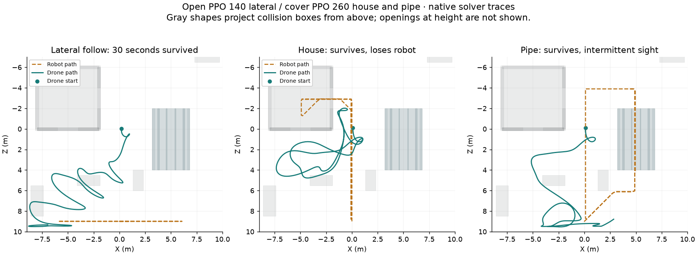

# Drone navigation research

The navigator follows moving visible targets in native trials, but does not yet
search the house and pipe reliably. Keep it out of the playable example.
The existing [waypoint pilot](DRONE_TRACKING.md) and combat controller remain unchanged.

The [research record](progress/drone-navigation-candidate.json) preserves exact
sources, raw measurements, checkpoint history, logs, model hashes, and restore paths.
Its base is commit `2b9fe8a20e3e6f0ab16478403c5c41db1229b92d`.

## Results

The unchanged motor pilot survived 20 moving-goal trials in an empty world.
Targets followed a three-metre-radius circle at 0.5, 1, 2, or 4 metres per second.
Mean distance after five seconds rose from approximately 0.50 to 3.55 metres.
Those trials supplied target positions directly and did not test perception.

The arena experiments use filtered sight and static obstacle measurements.
Direct pursuit survived all 15 initial trials, but saw the lateral target for
only 308–325 of 1,500 physics actions. Prediction alone caused collisions.
A clearance heuristic improved visibility on the seed-42 grid. Its later
body-relative implementation still crashed in all five lateral teacher trials.
The record retains both implementations and their results.

Imitation checkpoint 150 and open-route PPO checkpoint 140 each passed 192 fresh-seed
cases. Each case lasted 30 seconds and required survival, first sight within ten
seconds, and sight during at least 60% of physics actions. PPO's weakest case had
1,209 visible actions out of 1,500, or 80.6%. These cases covered stationary,
lateral, and approaching targets with delayed and immediate movement.
They did not establish hidden-target search.

Open-route PPO crashed in all ten subsequent house and pipe trials.
A 300-update cover curriculum produced checkpoint 260, which survived all 25
selection cases. A repeated ten-case cover audit also survived. Its weakest house
case had sight for 607 actions, or 40.5%; its weakest pipe case had 757, or 50.5%.

At seed 42, sampled traces show approximately 8.5 seconds without sight near the
house and 9.9 seconds near the pipe before reacquisition. Samples are 0.1 seconds
apart. These are selection cases, not held-out qualification.



The image projects collision boxes from above. It does not show openings at height.
It is a plot of solver measurements, not a gameplay screenshot.
The [earlier collision traces](progress/drone-navigation-paths.png) and
[baseline measurements](progress/drone-navigation-measurements.png) preserve the failures.

## Observation and action contract

The experimental navigator chooses a local goal every 100 milliseconds.
The unchanged motor pilot applies thrust every 20 milliseconds.
Actor and critic receive the same 32 values. Neither receives hidden target
coordinates, route identifiers, or route stages.

The inputs contain height, body-frame velocity, body-frame world-up, world-frame
angular velocity, horizontal heading, and horizontal position. They also contain
body-relative sight contact, its closed contact state, remembered-contact age,
measured target velocity, and eight obstacle ranges.

Sight uses the existing 90-degree cone, 20-metre range, occlusion queries, and
three-second memory. Velocity comes only from consecutive visible samples,
clamped to four metres per second. Unknown contact clears that velocity.

Obstacle ranges sample eight horizontal body-relative directions. Each direction
uses the nearest of three rays at vertical offsets of -0.4, 0, and 0.4 metres.
Ray length is three metres. The query world contains static arena obstacles.

Four actions describe body-relative goal displacement and heading change.
Displacement components scale by three metres; yaw scales by pi radians.
Goal coordinates clamp to X/Z ±9.5 metres and Y between one and four metres.
The motor pilot retains its three-metre displacement limit.
Both policies start with zero recurrent memory on every action.

Reward uses only visible contact. Each physics action contributes
`1 / (1 + ((distance_m - 5) / 3)^2) / 5` when the target is visible.
The constants represent a five-metre preferred distance, a three-metre error
scale, and five physics actions per navigator action. Termination subtracts five.
There is no reward derived from hidden target position.

## Training and selection

Imitation used seed 7, a 64-unit recurrent actor with zero carried state,
32 actor inputs, 32 critic inputs, and two 64-unit critic layers.
It trained 500 updates, with four 512-sample cloning batches per update.
Teacher-labelled learner rollouts expanded a replay buffer capped at 30,000 samples.
Checkpoint 150 maximized minimum visibility among evaluated checkpoints that
survived all 15 selection cases. Later checkpoints regressed.

Open PPO started from imitation 150 with a fresh critic and optimizers, using seed 19.
Eight lanes each collected 64 navigator actions per update for 200 updates.
Actor and critic learning rates were 0.0001 and 0.001. Minibatches contained 64
one-action sequences; the agent ran four epochs. Discount was 0.99 and GAE lambda
was 0.95.

Advantage traces stopped at termination and truncation; only truncation
bootstrapped the final state. Ten critic-only updates preceded the first actor update.

Entropy coefficient was 0.001. The log standard deviation stayed at -2 in the logs.
Checkpoint 140 maximized minimum visibility among surviving selection candidates.

Cover PPO started from open PPO 140 with another fresh critic and optimizers,
using seed 23 and the same settings for 300 updates. Routes included the house
and pipe. Each target waited six seconds inside cover before continuing its route.
Checkpoint 260 maximized minimum visibility among evaluated candidates surviving
all 25 selection cases. The record retains later regression results.

Fresh-seed open qualification used 32 seeds from `u64::MAX - 2001` through
`u64::MAX - 2032`, with six movement profiles per seed. Training reset seeds
occupy the lower half of the integer range. Selection used 0, 1, 2, 42, and
`u64::MAX`. Qualification did not vary arena geometry or target speed.

## Reproduce the research

The archive contains temporary research sources, not tutorial examples.
Their warnings include unused imported example methods and unreachable public
items. No strict Rust gate passed for these prototypes. Production Rust did not
change, and no new production coverage is claimed.

1. Use the recorded base commit in a separate worktree.
2. Restore the record's `sources` entries to their `restore_path` values.
3. Verify each restored source against its recorded SHA-256.
4. Copy the three model files to their recorded research paths.
5. Run the desired test with the repository's Nix environment.

For the repeated cover audit, use:

```sh
nix develop --command env -u CFLAGS \
  NAVIGATOR_CANDIDATE=runs/quality-research/navigation-cover-ppo/260.mpk \
  cargo test --no-default-features --features robots \
  --test drone_navigation_cover_probe audit_cover -- --nocapture
```

The restored qualifier accepts the same `NAVIGATOR_CANDIDATE` variable.
The archive retains experiment sources and compiler output. Other test names and
training settings are defined in those sources.
The selected imitation, open PPO, and cover PPO weights are stored beside this
record as `drone-navigation-imitation.mpk`, `drone-navigation-open.mpk`, and
`drone-navigation-cover.mpk`. These are research checkpoints only.

## Next acceptance checks

The next experiment must distinguish deliberate search from waiting until a
scripted target reappears. Keep the unchanged motor pilot's memory contract.
Evaluate navigator memory separately, using histories that end with identical
current observations but different last-seen target motion. Add the existing
hearing bearings without revealing hidden coordinates. Measure vertical clearance
before requiring flight through openings.

Require collision-free trials on fresh seeds and unseen target routes. Record
reacquisition time while targets remain behind cover, successful views through
windows and pipe ends, and distance from the target while visible. Retain adverse
cases alongside successful ones. Then verify the same model in WASM and show
rendered recordings before replacing the gameplay controller.

Damaged-motor pursuit, learning to loot or shoot, humanoid reinforcement learning,
and adversarial training remain unqualified. This research does not change the
existing damage effects, weapon behavior, or player controls.

## Research context

[Bhagat and Sujit, 2020](https://arxiv.org/abs/2007.10934) discuss UAV target
tracking with limited field of view, occlusion, and uncertain target motion.
[Singla, Padakandla, and Bhatnagar, 2018](https://arxiv.org/abs/1811.03307)
discuss recurrent reinforcement learning for obstacle avoidance under partial
observability. Only their abstracts were inspected for this experiment.
The local controller does not reproduce either paper's method.
