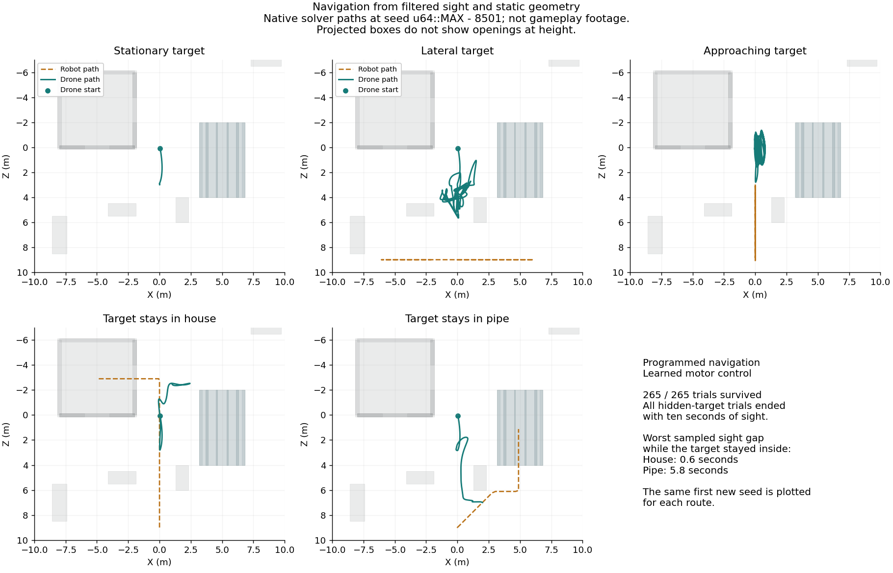

# Navigation from sightings

This research baseline combines programmed navigation with the existing learned
motor pilot. It receives its own flight observation and filtered sight. It cannot
read the target's scripted route or hidden position. Production Rust and browser
gameplay have not changed.

The [earlier learned navigator](DRONE_SEARCH.md) could imitate cover approaches but
failed moving-target pursuit. This baseline provides a separate control reference
and prospective training demonstrations. It does not replace learned-search,
damaged-flight, adversarial-training, or browser requirements.

## Geometry and observations

The planner copies the authored static boxes into a private Rapier 0.36.0 world.
The world contains no moving character. The versioned
[PhysicsWorld documentation](https://docs.rs/rapier3d/0.36.0/rapier3d/pipeline/struct.PhysicsWorld.html#method.cast_shape)
and installed crate source define the shape queries used here.

The graph has 39 by 39 cells at 0.5-metre spacing, with X/Z coordinates from
-9.5 through 9.5 metres and Y fixed at 2 metres. Adjacent cells and command
shortcuts require a clear sphere sweep. This is horizontal planning, not full
three-dimensional pathfinding. Normal clearance uses a 0.9-metre sphere.

If flight drifts inside that margin, the planner first tries an escape toward a
clear cell using a 0.45-metre sphere. The physical body's half dimensions are
0.287, 0.104, and 0.297 metres. Its circumscribed radius is below 0.426 metres,
so the escape sphere encloses that collider at any orientation. This geometric
check does not prove that the motor controller will follow the segment exactly.

Navigation runs every 100 milliseconds; the frozen motor pilot acts every
20 milliseconds and resets its own recurrent memory each action. The heading
reference changes by at most 0.1 radians per navigation decision. That limits
the command reference to one radian per second, not the actual body's angular speed.

The planner estimates horizontal target velocity from consecutive visible samples,
limits the estimate to four metres per second, and uses a half-second lead while
tracking. It prefers a six-metre viewing distance. Investigation retains the last
observed point and velocity for at most ten seconds.

Search samples potential target positions on a one-metre grid at Y = 1 metre.
It records when a sample was within the body-centred viewing cone and had a clear
static ray. Recently checked samples are skipped for ten seconds. A clear ray to
a sample does not prove an entire cell is empty. The production sensor uses an
offset eye; aligning this heuristic with that origin remains an integration check.

The query graph and search samples come from geometry, with no named house or
pipe destination. The planner chooses reachable viewing cells and uses clear
shortcuts up to 2.5 metres long. Its current implementation allocates graph-search
scratch storage each decision. No browser-performance or allocation claim is made.

## Measured failures and changes

The first map planner survived all 25 selection trials but never saw either held
target. It continued looking at an empty last-seen point. Adding recently checked
search samples recovered all five house cases, while pipe cases remained unseen.

The next trace exposed a different failure: the drone entered the conservative
clearance margin and could no longer connect to the graph. Allowing the smaller
escape sphere recovered all five pipe cases. However, eight moving-target trials
crashed. Limiting heading-reference changes then kept all 25 trials airborne.

Increasing the viewing distance from four to six metres improved moving-target
visibility. That version survived all 25 selection trials and all 160 fresh-seed
trials. Both hidden routes ended with uninterrupted sight in all selection trials,
but two fresh pipe trials never saw the held target. The lowest fresh lateral
visibility was only 958 of 3,000 physics samples.

The initial scan could be interrupted by exploration before the drone finished
turning. The latest variant starts scanning from the measured body heading and
allows up to eight seconds of scanning before exploration if it has no sighting.
Any visible target interrupts scanning immediately. Its test includes all prior
selection and qualification seeds plus 16 new seeds per route.

## Latest native results

All 265 trials survived 60 seconds. The set covers five routes for 53 seeds:
the five selection seeds, 32 earlier qualification seeds, and 16 new seeds.
The lowest overall sight count was 1,968 of 3,000 physics samples for lateral
movement, or 65.6%. Every house and pipe trial ended with ten uninterrupted
seconds of sight.

House trials saw the held robot in at least 500 of 506 sampled decisions.
Pipe trials saw it in at least 464 of 522. The longest sampled gaps while the
robot stayed inside were 0.6 seconds for the house and 5.8 seconds for the pipe.
The earlier provisional 90% held-visibility gate still fails all 53 pipe cases.
The other four routes pass their earlier provisional checks. These results support
further integration work; they do not establish complete gameplay qualification.

The figure uses the same first new seed for every route. The house path finds a
view through the doorway. It does not establish window-only search. Target paths,
speed, arena geometry, and healthy motor configuration remain fixed.

The [research record](progress/drone-planner-baseline.json) retains exact sources,
logs, variant summaries, and restore instructions. The
[compressed trial archive](progress/drone-planner-trials.json.gz) preserves all raw
outputs, including failed variants. Each decompressed entry contains its original
path, SHA-256, and exact UTF-8 text. No research process remains active.

## Implementation gate

Before browser integration, convert the prototype into documented example code
with focused behavioral tests. Align search rays with the production eye origin
and define how an initial remembered contact seeds investigation. Keep navigation
inputs restricted to filtered observations and static geometry.

Test empty sight, finite-memory expiry, blocked starts, failed routes, escape
clearance, scan initialization, heading-reference limits, reset, and both moving
and hidden targets. Add a blocked-door fixture to require a window viewpoint.
Measure changed-branch coverage and run the required native, personal-lint, and
WASM gates. Prototype compiler warnings are not clean production validation.

Then connect the controller to the playable arena and inspect desktop and narrow
browser views with recordings. Label programmed navigation and learned flight
separately. Keep learned-search, hearing, damaged-flight, and adversarial-training
work in the active roadmap. [Execution status](EXAMPLE_STATUS.md) records the next step.
