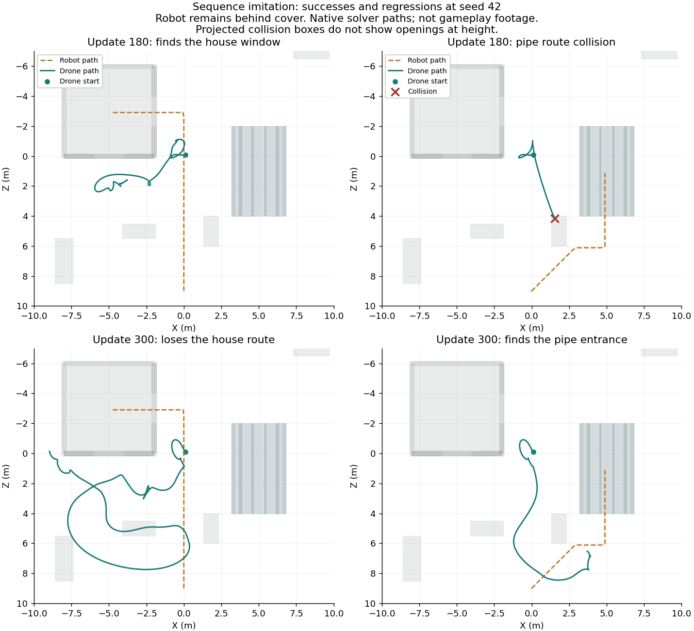
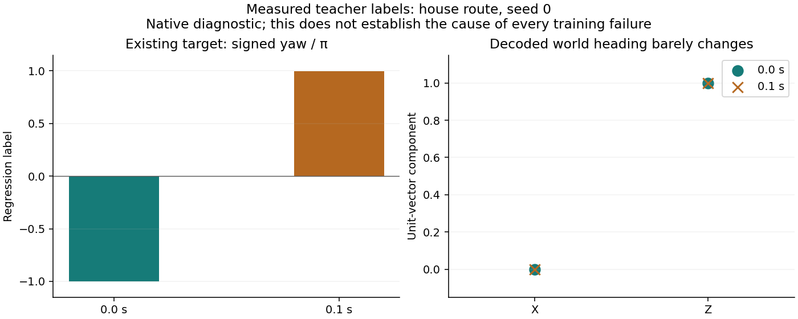
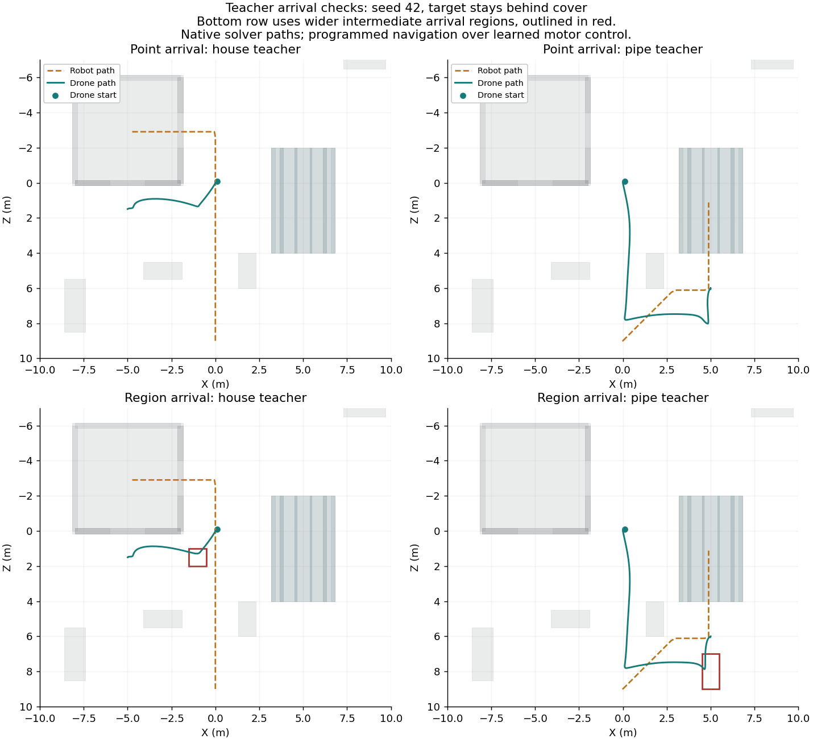
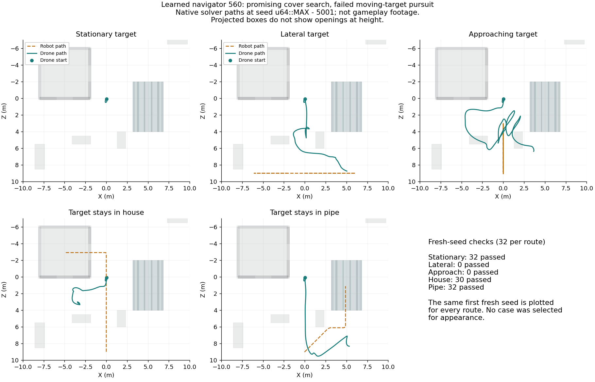

# Hidden-target search experiments

No trained navigator yet passes all cover and moving-target checks.
The [earlier navigation trials](DRONE_NAVIGATION.md) let targets leave cover.
These trials keep the robot inside the house or pipe for the rest of a
60-second episode. That change separates search from waiting for the robot
to reappear.

The [experiment record](progress/drone-hide-candidate.json) contains exact sources,
restore paths, raw traces, logs, model hashes, and checkpoint history.
Production Rust, game controls, and the browser controller remain unchanged.

## Permanent-cover baseline

Cover PPO 260 survived all ten trials. In five pipe trials it had no visible
samples after the robot stopped inside. In five house trials it had only 33–34
visible samples out of 506 samples while the robot stayed inside.
Each sample is one navigator decision, or 100 milliseconds.
These trials use selection seeds 0, 1, 2, 42, and `u64::MAX`.

The upper paths show the learned baseline. The lower paths use chosen waypoints
to check physical access. These are native solver measurements, not gameplay
screenshots. Projected collision boxes do not show openings at height.

## Physical access and the teacher

The motor pilot can reach a viewing position outside the house window at
`(-5, 2, 1.5)` metres and outside the pipe at `(5, 1.6, 6)` metres.
Coordinates use X, Y, Z order. Facing negative Z from either position reveals
the robot inside the corresponding cover. The fixed-waypoint tests survived all
ten trials and retained sight throughout the sampled period inside cover.

The first pipe route collided with a cover block in all five cases.
Its diagonal approach crossed the block near X 2.1, Y 1.7, Z 6.4 metres.
The corrected route first goes to `(0, 2, 8)`, then `(5, 2, 8)`, then the pipe
viewing position. The archive retains the failed route and its traces.

A second teacher chooses its route from filtered sight. It initially holds
position and faces positive Z. It chooses the pipe approach after seeing the
robot beyond X 1 metre with Z above 4.5 metres. It chooses the window approach
after seeing the robot below Z 7.5 metres with absolute X below 1 metre.
Those thresholds describe this fixed training setup, not a general search API.

The teacher retains its chosen course and advances through explicit waypoint
states. It receives only filtered sight and its own flight pose. It does not read
the task's target route, hidden position, or movement stage. It uses known arena
waypoints, so its successful route choice is programmed behavior.

This teacher survived all ten trials. It saw the robot in every sampled house
hold and in 498 of 522 sampled pipe holds. In the pipe cases, it first regained
sight at 10.3 seconds, about 2.4 seconds after the robot stopped inside.
All ten trials had uninterrupted sight during their final 100 samples.

## Distillation results

The first imitation run started from cover PPO 260 with seed 31.
It used the earlier 32-input architecture and reset actor memory each decision.
Twenty teacher episodes supplied initial samples. Each update reused one sampled
512-example batch for four gradient steps. Learner rollouts supplied teacher labels
every five updates.

The run ended after 300 updates. The source records replay limits and sampling.

Checkpoint 240 survived both courses and saw the house target in at least 502 of
506 held samples. It never saw the pipe target while held. A separate trace audit
of checkpoint 280 found the same pipe failure and at least 487 house sightings.
The pipe trajectory settled near `(0.93, 2.02, 7.68)` metres, short of the teacher's
0.25-metre waypoint-arrival threshold.

The second teacher lets the first pipe waypoint advance when Z is at least seven
metres and absolute X is below 1.5 metres. The other arrival thresholds remain
0.25 metres. The widened teacher passed all ten physical-access trials.
A second 300-update imitation run started from checkpoint 280 with seed 37.

The widened curriculum produced checkpoints that saw the robot inside the pipe,
but they lost the house behavior. Checkpoint 180 survived both courses and had
at least 499 of 522 held pipe samples visible; every held house sample was hidden.
No evaluated checkpoint passed both courses. Later checkpoints also regressed
or crashed. None is eligible for gameplay installation.

## Recurrent experiment result

The user service `bevy-gym-navigation-memory-ppo-20261009` completed all
300 updates. No evaluated checkpoint saw the robot during a held pipe sample.
The final checkpoint crashed in all five house trials and survived all five pipe
trials without finding the robot. No checkpoint qualifies for gameplay.
The archive now includes the complete history and log.

This run starts from cover PPO 260 with a fresh critic and optimizers, using seed 29.
It carries actor memory between decisions and resets memory at episode boundaries.
Eight lanes collect 64 decisions per update. Training chunks contain at most
16 contiguous decisions and never cross episode boundaries. Their initial memory
comes from the rollout immediately before the chunk. The motor pilot still uses
zero memory on every action.

Actor and critic receive the same 32 filtered inputs. The critic remains a
feed-forward model. PPO settings match the earlier experiment except for
32 sequences per minibatch, temporal chunks, and the 60-second permanent-cover
profile. Rollout memory persists across parameter updates without a burn-in pass.
These results reject this training run; they do not rule out recurrent navigation.

## Next work and verification limits

The teacher's course persists after sight expires, while the imitation actor's
memory resets every decision. The teacher can therefore request different actions
for identical current observations after different histories. A memoryless actor
cannot represent that distinction. This is a structural limitation; the observed
regressions do not establish it as their only cause.

Use [sequence cloning](RECURRENT_IMITATION.md) to test supervised training across
observation histories, so the actor can learn which past observations matter.
Keep source history, adverse cases, and selection results. Do not repeat the
unchanged physical-access calibration to resume.

Before gameplay integration, require fresh-seed permanent-cover trials, both cover
routes, and the earlier moving-target profiles. Add unseen paths, hearing,
vertical-clearance measurements, and targets that choose different hiding places.
Verify WASM execution and show rendered recordings of the selected model.
The current research has no new browser evidence or fresh-seed search qualification.

The prototype tests emit unused-item and unreachable-public-item warnings.
They are archived research sources, not finished tutorial examples, and no clean
strict Rust gate is claimed. Documentation lint, archive hashes, and local links
are the gates for this documentation checkpoint. The earlier temporary training tests are archived. The earlier training services have stopped.

## Ordered sequence imitation

The [sequence archive](progress/drone-sequence-candidate.json) records a completed
300-update run using `behavior_clone_sequence`. Actor memory persists within each
episode. The motor pilot still resets its own memory each action.
The actor starts from cover PPO 260, with seed 43 and learning rate 0.0005.

Each update trains one contiguous chunk per route, up to 128 decisions.
The current actor reconstructs initial memory from that episode's earlier observations.
Gradients stop at the chunk boundary.

Ten teacher episodes per route remain in replay. Every ten updates, a learner
rollout per route adds teacher labels. Replay retains the latest four learner
episodes per route. Sampling includes episode starts, early movement, arbitrary
positions, and episode tails. The archive preserves the exact recipe and sources.

No evaluated checkpoint passed both routes across all five selection seeds.
Update 180 survived all five house cases and saw the hidden robot in at least
435 of 506 samples, but crashed in all five pipe cases. Update 300 survived all
five pipe cases, with 357–488 visible held samples out of 522. It survived four
house cases; three house cases had no visible held samples.
The two saved models are research artifacts and must not enter gameplay.

These paths are native solver measurements. They do not verify browser execution,
fresh seeds, earlier moving-target profiles, damaged flight, or general search.
The native research tests completed successfully but emitted prototype warnings.
Their passing exit codes do not establish clean production lint gates.

A finite follow-up trains complete episodes so later losses can reach the earlier
route-choice observations. It retains the same model initialization and settings,
but removing random chunk-start draws also changes later episode selections.
This comparison can test the combined recipe; it cannot isolate chunk length alone.

The follow-up completed 300 updates without a qualified checkpoint.
Update 180 survived all ten cases but never saw the held pipe target. Update 220
saw the held pipe target in at least 502 samples, but crashed in every house case.
The sequence archive now includes the full history, exact source, and terminal log.

## Heading-target diagnostic

The [heading diagnostic](progress/drone-heading-diagnostic.json) found a target
discontinuity in all ten teacher trials. At the first two decisions, the scalar
yaw label changes from -1.0 to about +0.995574. The requested physical heading
barely changes. In house seed 0, decoding both targets into world headings gives
a difference below 0.00001 degrees. Averaging scalar labels near these opposite
ends would request approximately zero rotation, which faces the wrong direction.

A research variant emits five action components: body displacement X, Y, Z,
then world heading X, Z. Displacement still scales by three metres and uses the
existing goal bounds. The heading pair becomes a unit direction. A zero pair
retains the drone's current horizontal heading. The teacher survives all ten
trials and retains sight in every final 100-sample window with this representation.

The finite learner trial starts a fresh five-output actor with seed 43 and the
same chunk recipe, for 600 updates. It cannot reuse the four-output checkpoint.
Initialization, action dimension, loss weighting, and update budget also change;
this trial cannot isolate heading encoding as the cause of a measured improvement.
No production API, checkpoint format, or gameplay controller changes.

The run completed all 600 updates without a qualified checkpoint.
At update 300, all ten cases survived. House trials retained sight in only
91–100 of 506 held samples; pipe trials retained sight in 451–456 of 522.
The saved model and two seed-42 traces remain diagnostic artifacts.

The house trace never enters the teacher's 0.25-metre arrival radius around
`(-1, 2, 1.5)` metres. Its closest sampled position is 0.389 metres away at
6.1 seconds. Teacher arrival checks use these same decision boundaries.
This motivates checking safe arrival regions before another distillation run.
It does not establish the cause of every failure.

## Intermediate arrival regions

The next teacher variant replaces two 0.25-metre point-arrival tests with closed
regions. The house corner uses X [-1.5, -0.5], Y [1.5, 2.5], Z [1, 2] metres.
The pipe crossing uses X [4.5, 5.5], Y [1.5, 2.5], Z [7, 9] metres.
The destination positions, headings, pipe approach predicate, and motor pilot
remain unchanged. The current action retains the old goal; the next action uses
the advanced state, as in the earlier teacher.

The [arrival-region archive](progress/drone-arrival-region-candidate.json) records
74 successful teacher trials: both routes for the five selection seeds and
32 additional seeds `u64::MAX - 4001` through `u64::MAX - 4032`.
Every trial survived 60 seconds and retained sight for its final 100 samples.
House trials saw the held robot in all 506 samples. Pipe trials saw it in at
least 502 of 522 held samples. These trials sample reset variation in the fixed
arena; they do not prove clearance from every point in either arrival region.

The figure shows programmed navigation over the existing learned motor pilot.
It is a native solver measurement, not a learned-search or browser qualification.
The learner uses the same initialization, action shape, seed, chunk/replay recipe,
and 600-update budget as the previous vector-heading run. Only the teacher's two
arrival predicates change. Changed trajectories naturally change later training data.

The run completed 600 updates. Update 560 survived all ten selection cases,
with at least 459 of 506 visible house-hold samples and 482 of 522 pipe-hold
samples. Later updates regressed; update 600 crashed in all ten cases.

The selected candidate then ran 160 fresh-seed trials: five routes for seeds
`u64::MAX - 5001` through `u64::MAX - 5032`. Every trial lasts up to 60 seconds.
The research gate requires survival. Cover routes also require at least 90%
held visibility and 90 visible samples in the final 100-sample window.
Open routes require first sight by action 500 and at least 60% overall visibility.
These thresholds were fixed before this fresh-seed run; they are provisional
research checks, not the complete gameplay acceptance contract.

Stationary targets passed 32/32, house targets 30/32, and pipe targets 32/32.
Lateral and approaching targets each passed 0/32. Three lateral trials crashed;
the other 157 trials survived. The candidate remains rejected for gameplay.
Its model, complete result rows, and five predetermined fresh-seed traces are archived.

The teacher selects a house or pipe course from early sightings and then follows
fixed waypoints. It never returns to unrestricted pursuit. This source constraint
limits the demonstrations even though the learner can imitate both cover routes.
Do not repeat this two-route distillation recipe as a route to general player pursuit.

Next, build a perception-driven navigation baseline that accepts current sight,
bounded last-seen information, its own flight state, and static collision geometry.
It must not receive a target route or hidden target coordinates. Preserve learned
motor control, add collision-aware route planning, and test moving targets alongside
both permanent-cover cases. Keep programmed navigation and learned navigation
explicitly labeled. Learned-search and adversarial-training work remains required.
