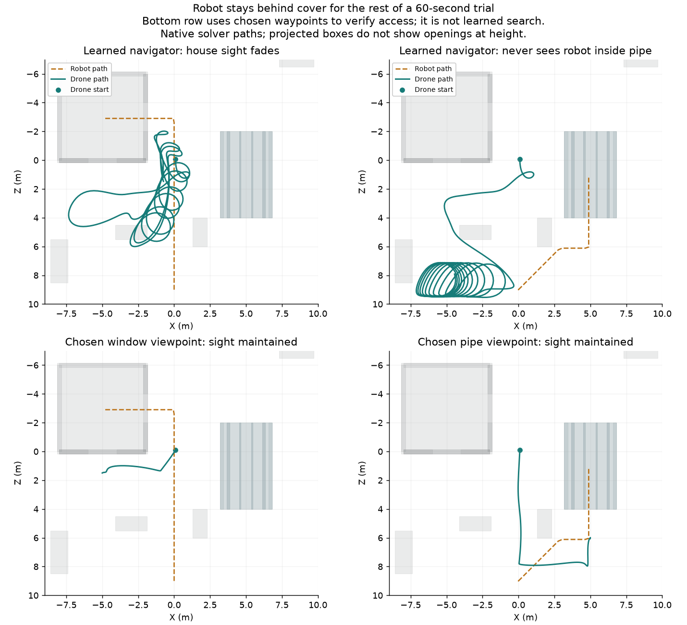

# Hidden-target search experiments

No trained navigator yet passes both permanent-cover cases.
The [earlier navigation trials](DRONE_NAVIGATION.md) let targets leave cover.
These trials keep the robot inside the house or pipe for the rest of a
60-second episode. That change separates search from waiting for the robot
to reappear.

The [experiment record](progress/drone-hide-candidate.json) contains exact sources,
restore paths, raw traces, logs, model hashes, and checkpoint history.
Production Rust, game controls, and the browser controller remain unchanged.

## Permanent-cover baseline

Cover PPO 260 survived all ten trials. In five pipe trials it had no visible
samples after the robot stopped inside. In five house trials it had only 33–34
visible samples out of 506 samples while the robot stayed inside.
Each sample is one navigator decision, or 100 milliseconds.
These trials use selection seeds 0, 1, 2, 42, and `u64::MAX`.

The upper paths show the learned baseline. The lower paths use chosen waypoints
to check physical access. These are native solver measurements, not gameplay
screenshots. Projected collision boxes do not show openings at height.

## Physical access and the teacher

The motor pilot can reach a viewing position outside the house window at
`(-5, 2, 1.5)` metres and outside the pipe at `(5, 1.6, 6)` metres.
Coordinates use X, Y, Z order. Facing negative Z from either position reveals
the robot inside the corresponding cover. The fixed-waypoint tests survived all
ten trials and retained sight throughout the sampled period inside cover.

The first pipe route collided with a cover block in all five cases.
Its diagonal approach crossed the block near X 2.1, Y 1.7, Z 6.4 metres.
The corrected route first goes to `(0, 2, 8)`, then `(5, 2, 8)`, then the pipe
viewing position. The archive retains the failed route and its traces.

A second teacher chooses its route from filtered sight. It initially holds
position and faces positive Z. It chooses the pipe approach after seeing the
robot beyond X 1 metre with Z above 4.5 metres. It chooses the window approach
after seeing the robot below Z 7.5 metres with absolute X below 1 metre.
Those thresholds describe this fixed training setup, not a general search API.

The teacher retains its chosen course and advances through explicit waypoint
states. It receives only filtered sight and its own flight pose. It does not read
the task's target route, hidden position, or movement stage. It uses known arena
waypoints, so its successful route choice is programmed behavior.

This teacher survived all ten trials. It saw the robot in every sampled house
hold and in 498 of 522 sampled pipe holds. In the pipe cases, it first regained
sight at 10.3 seconds, about 2.4 seconds after the robot stopped inside.
All ten trials had uninterrupted sight during their final 100 samples.

## Distillation results

The first imitation run started from cover PPO 260 with seed 31.
It used the earlier 32-input architecture and reset actor memory each decision.
Twenty teacher episodes supplied initial samples. Each update reused one sampled
512-example batch for four gradient steps. Learner rollouts supplied teacher labels
every five updates.

The run ended after 300 updates. The source records replay limits and sampling.

Checkpoint 240 survived both courses and saw the house target in at least 502 of
506 held samples. It never saw the pipe target while held. A separate trace audit
of checkpoint 280 found the same pipe failure and at least 487 house sightings.
The pipe trajectory settled near `(0.93, 2.02, 7.68)` metres, short of the teacher's
0.25-metre waypoint-arrival threshold.

The second teacher lets the first pipe waypoint advance when Z is at least seven
metres and absolute X is below 1.5 metres. The other arrival thresholds remain
0.25 metres. The widened teacher passed all ten physical-access trials.
A second 300-update imitation run started from checkpoint 280 with seed 37.

The widened curriculum produced checkpoints that saw the robot inside the pipe,
but they lost the house behavior. Checkpoint 180 survived both courses and had
at least 499 of 522 held pipe samples visible; every held house sample was hidden.
No evaluated checkpoint passed both courses. Later checkpoints also regressed
or crashed. None is eligible for gameplay installation.

## Recurrent experiment in progress

The user service `bevy-gym-navigation-memory-ppo-20261009` runs a finite
300-update PPO experiment. Inspect its live state before restarting it.
Its log is `/home/sagan/.cache/bevy-gym-quality-validation/navigation-memory-ppo.log`.
Checkpoints go to `runs/quality-research/navigation-memory-ppo/`.
The record's `active_run.snapshot_max_update` identifies the archived cutoff.

This run starts from cover PPO 260 with a fresh critic and optimizers, using seed 29.
It carries actor memory between decisions and resets memory at episode boundaries.
Eight lanes collect 64 decisions per update. Training chunks contain at most
16 contiguous decisions and never cross episode boundaries. Their initial memory
comes from the rollout immediately before the chunk. The motor pilot still uses
zero memory on every action.

Actor and critic receive the same 32 filtered inputs. The critic remains a
feed-forward model. PPO settings match the earlier experiment except for
32 sequences per minibatch, temporal chunks, and the 60-second permanent-cover
profile. Rollout memory persists across parameter updates without a burn-in pass.
The archive contains partial results; they do not prove terminal success or failure.

## Next work and verification limits

The teacher's course persists after sight expires, while the imitation actor's
memory resets every decision. The teacher can therefore request different actions
for identical current observations after different histories. A memoryless actor
cannot represent that distinction. This is a structural limitation; the observed
regressions do not establish it as their only cause.

Finish inspecting the live recurrent run. Then test supervised training across
observation sequences so the actor can learn which past observations matter.
Keep source history, adverse cases, and selection results. Do not repeat the
unchanged physical-access calibration to resume.

Before gameplay integration, require fresh-seed permanent-cover trials, both cover
routes, and the earlier moving-target profiles. Add unseen paths, hearing,
vertical-clearance measurements, and targets that choose different hiding places.
Verify WASM execution and show rendered recordings of the selected model.
The current research has no new browser evidence or fresh-seed search qualification.

The prototype tests emit unused-item and unreachable-public-item warnings.
They are archived research sources, not finished tutorial examples, and no clean
strict Rust gate is claimed. Documentation lint, archive hashes, and local links
are the gates for this documentation checkpoint. The live training test remains
untracked until its process finishes; its exact source is already archived.
