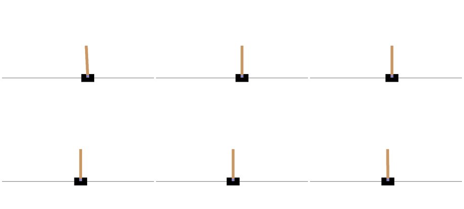
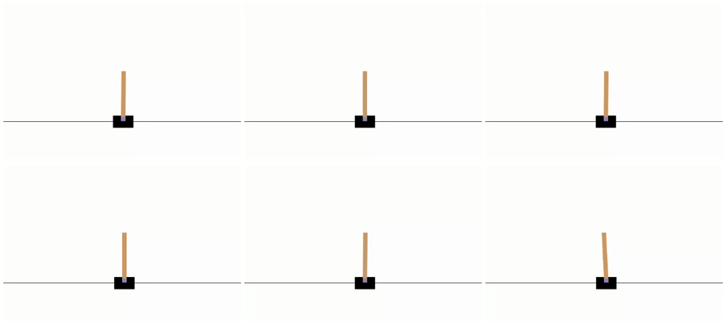
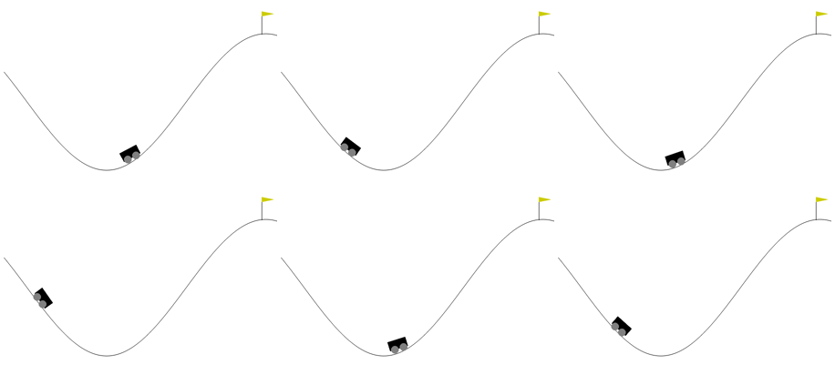
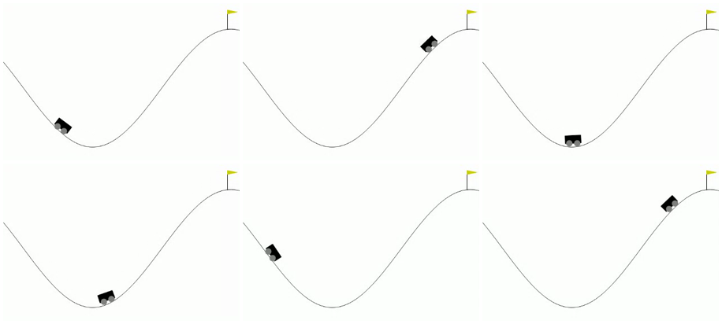
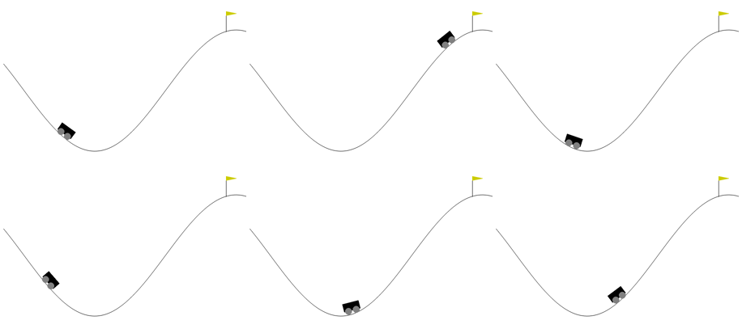
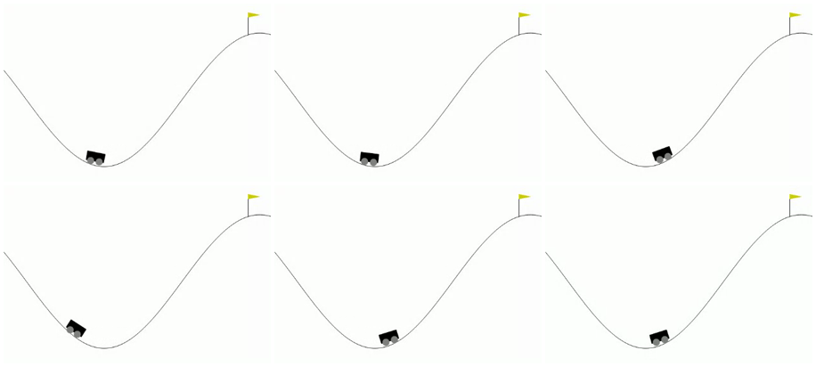

# Gymnasium visual comparisons

The scene must match Gymnasium's assets, geometry, colors, proportions, and
motion. Different states may place moving objects at different positions.
The surrounding training controls are Bevy Gym's interface.

## Reference captures

[Reference manifest](references/manifest.json) records 23 GIFs downloaded from
the official documentation on 2026-10-08, their SHA-256 hashes, durations, and
six-frame contact sheets. The sheets sample each GIF across its full duration,
read left to right. The manifest records whether each download matches the
pinned repository's GIF bytes; documentation assets can change independently.

The original downloads remain in the ignored `runs/visual-references` directory.
Regenerate downloads and sheets from the repository root with Python 3,
FFmpeg, and the pinned `ref/gymnasium` checkout available:

```sh
python scripts/gymnasium_visual_reference.py
```

The original Gymnasium [MIT license](../../gymnasium-web/tests/fixtures/GYMNASIUM-LICENSE)
applies to the reference artwork and ported rendering code.

## CartPole

Gymnasium documentation:



Bevy Gym browser inference:



[Browser recording](classic-control/cartpole.webm) shows bundled inference,
then fresh training and the mobile layout. Both simulations run in the local
Rust worker. The contact sheet uses six frames from the inference segment.

## MountainCar

Gymnasium documentation:



Bevy Gym browser inference:



[Browser recording](classic-control/mountain-car.webm) shows bundled inference,
then fresh training and the mobile layout. The policy reaches the goal sooner
than the documentation's policy. Terrain, car rotation, wheel placement,
flag, colors, and scene proportions match the source renderer.

[Deployed recording](classic-control/mountain-car-deployed.mp4) and its
[contact sheet](classic-control/mountain-car-deployed-preview.png) retain the
GitHub Pages verification.

## Continuous MountainCar

Gymnasium documentation:



Bevy Gym browser inference:



The [browser recording](classic-control/mountain-car-continuous.webm) shows
bundled inference, fresh PPO training, and the mobile layout. This task reuses
the upstream MountainCar geometry with its goal flag at position 0.45.

The [deployed recording](classic-control/mountain-car-continuous-deployed.mp4)
shows inference, pause, single-step, and fresh training on GitHub Pages.
Its [training screenshot](classic-control/mountain-car-continuous-deployed-training.png)
retains the optimizer counters and curves. This capture followed a refresh of
stale worker assets from an earlier deployment. Asset versioning now has a
separate browser regression.

## Pendulum

The browser renderer uses the original 500 by 500 geometry and unmodified
torque-arrow image. Four fixed states cover upright, downward, positive-torque,
and negative-torque rendering. All three browser engines pass the comparison.
The [port contract](../../gymnasium-web/PENDULUM.md) records pending training
qualification, page controls, and motion review.

## Automated comparison

CartPole and MountainCar draw procedural shapes; their upstream renderers use
no sprite assets. The browser ports those drawing operations from Gymnasium
revision `7a1191388aa4aa973d3a5e4b039899cd99cc991f`. Other environments must reuse
upstream image or model assets where their renderers use them.

Ten fixed-state PNGs come directly from the pinned Pygame renderer:
CartPole upright and tilted; both MountainCar tasks in the valley and on the slope;
and Pendulum upright, downward, with positive torque, and with negative torque.
`tests/fixtures/gymnasium/generate_rendering.py` regenerates them with NumPy,
Pygame, and Pillow. Set `PYTHONPATH=ref/gymnasium` and
`SDL_VIDEODRIVER=dummy` before running the generator.

Browser tests compare foreground pixels in both directions, so white
background area cannot conceal a missing object. Less than 0.5% of foreground
pixels may lack a match within two pixels and 80 units per RGB channel.
This tolerance permits Pygame and Canvas edge rasterization differences;
it does not establish byte-identical images. Tests retain each actual PNG.

```sh
nix run .#gymnasium-check -- --grep 'Gymnasium rendering|visual review'
```

The visual-review tests retain desktop and mobile screenshots and full browser
recordings under `test-results/gymnasium`. GitHub Actions retains those artifacts
for 14 days. This directory keeps the reviewed recordings and contact sheets.
The recordings in this change show the local build; deployed verification is
recorded separately after GitHub Pages publishes the tested artifact.

Future ports require their own fixed-state comparisons, recordings, contact
sheets, and movement review before their visual gate is complete.
