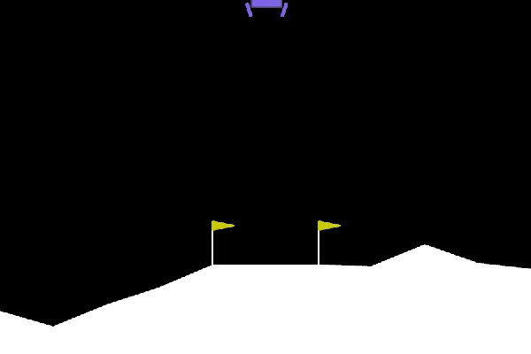
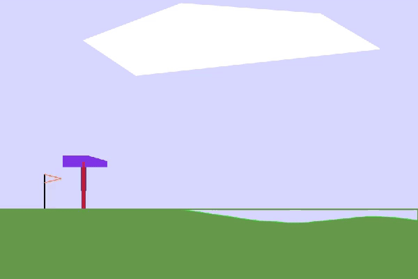
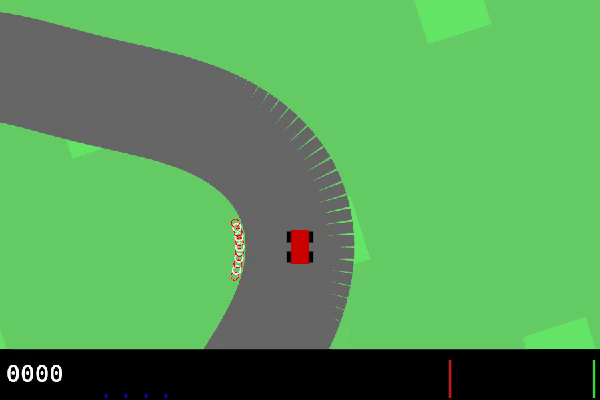

# Experimental Box2D task approximations

These are not faithful Gymnasium ports. Their historical scores describe only
the approximate dynamics. Avian is no longer a default dependency.
See the [replacement plan](../../GYMNASIUM_BROWSER_PLAN.md).

Each example starts in visual mode by default. Use the explicit `train` command
for headless batched training.

These examples use handwritten approximate dynamics. Their reset streams now
regenerate terrain and other documented stochastic state, but they are not
Box2D numerical replicas.

## LunarLander-v3

The approximate environment mirrors Gymnasium's eight observations, four discrete
engines, dense shaping reward, engine costs, terminal rewards, 1,000-step
limit, procedural terrain, lander silhouette, exhaust, and 600x400 framing.
The DQN workflow uses learning rate `0.0003` and a 50% warm-start mixture of
Gymnasium's published heuristic trajectories. Checkpoint selection and all
reported evaluation use the greedy neural policy without heuristic actions.
The selected checkpoint reached 100% safe landings and mean returns of `204.37`
and `205.01` on two separate 100-episode holdouts, above Gymnasium's `200`
registry threshold.

```sh
cargo run --no-default-features --release --example lunar-lander -- train
cargo run --release --example lunar-lander
```



[30-second checkpoint progression](../../docs/videos/lunar-lander.mp4)

## BipedalWalker-v3

The approximate environment mirrors Gymnasium's 24 observations, four bounded hip and
knee motors, two ground contacts, 10 lidar fractions, 50 Hz step, shaping
delta, motor cost, fall penalty, finish line, and 1,600-step limit. The
selected actor-rate-`0.003` checkpoint scored held-out means of `342.848`,
`342.875`, and `342.837` across three independent 100-episode schedules.
Every episode exceeded Gymnasium's `300` registry threshold and finished in
about 1,353 steps.

```sh
cargo run --no-default-features --release --example bipedal-walker -- train
cargo run --release --example bipedal-walker
```



[30-second checkpoint progression](../../docs/videos/bipedal-walker.mp4)

## CarRacing-v3

The approximate environment mirrors Gymnasium's procedural closed road, three bounded
continuous controls, 50 Hz step, per-tile reward, frame cost, 95% lap
completion at the start tile, playfield failure, and 1,000-step limit. The
renderer matches Gymnasium's 600x400 car-centered camera, road and grass
palette, red-white borders, car silhouette, and indicator panel. The shared PPO
workflow uses a documented 14-scalar projection of the visible track state
because it currently accepts vector observations.

The selected actor-rate-`0.003` checkpoint reached held-out mean returns of
`928.311`, `927.817`, and `927.166` across three independent 100-episode
schedules. The corresponding success rates were 89%, 88%, and 87% against
Gymnasium's `900` registry threshold.

```sh
cargo run --no-default-features --release --example car-racing -- train
cargo run --release --example car-racing
```



[30-second checkpoint progression](../../docs/videos/car-racing.mp4)
