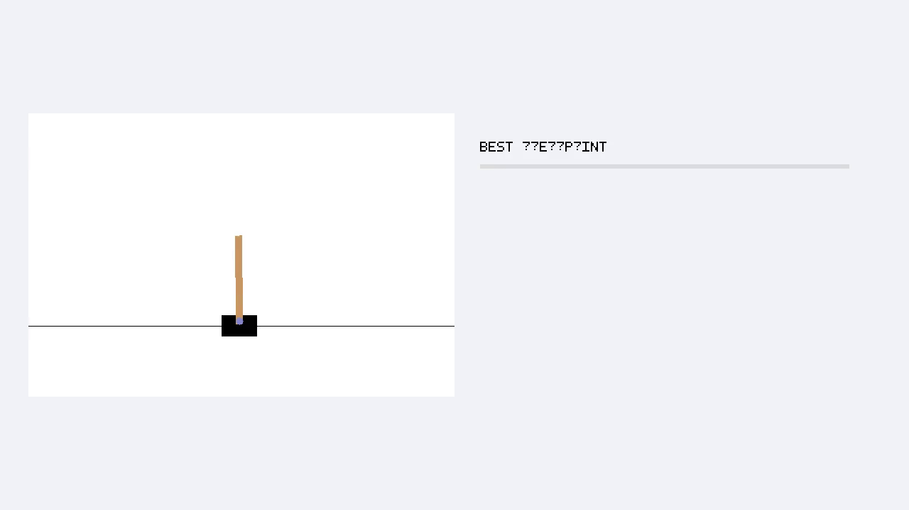
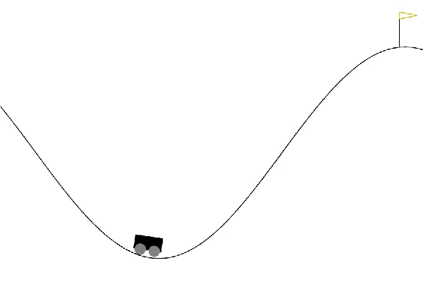
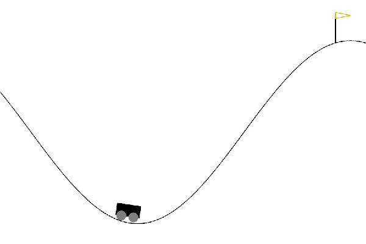
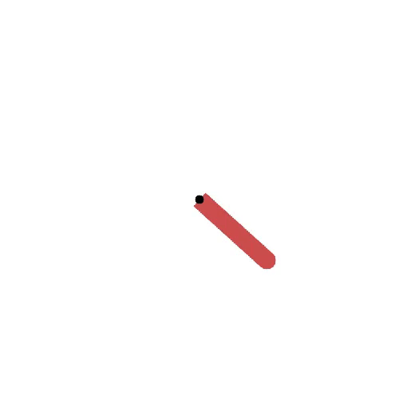
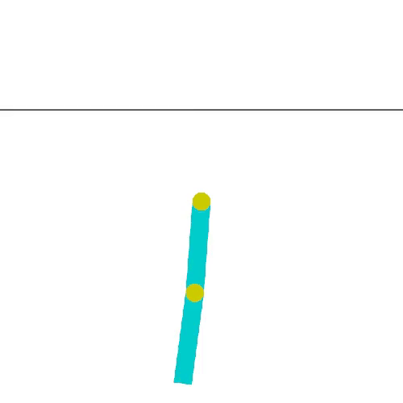

# Classic Control examples

Each example starts in visual mode by default. Use the explicit `train` command
for headless batched training.

## CartPole-v1

The environment uses Gymnasium's exact four observations, two discrete forces,
Euler transition equations, `+1` reward, 500-step limit, and cart-pole
geometry. The selected DQN checkpoint learned from scratch without behavior
cloning or reward shaping. Its held-out mean improved from `8.92` to the
maximum `500`, above Gymnasium's `475` registry threshold.

```sh
cargo run --no-default-features --release --example cartpole -- train
cargo run --release --example cartpole
```



[30-second checkpoint progression](../../docs/videos/cartpole.mp4)

## MountainCar-v0

The environment uses Gymnasium's exact state bounds, transition equations,
`-1` environment reward, 200-step limit, 600x400 curve, car, wheels, and flag.
The selected DQN profile uses learning rate `0.001` and altitude-potential scale
`25`. Its best checkpoint reached `-107.83` over 100 held-out episodes with a
100% goal rate, above Gymnasium's `-110` registry threshold.

```sh
cargo run --no-default-features --release --example mountain-car -- train
cargo run --release --example mountain-car
```



[30-second checkpoint progression](../../docs/videos/mountain-car.mp4)

## MountainCarContinuous-v0

The environment uses Gymnasium's exact continuous force, transition equations,
control cost, goal bonus, 999-step limit, 600x400 curve, car, wheels, and flag.
The selected recurrent PPO profile uses actor rate `0.003`, critic rate `0.001`,
and altitude-potential scale `25`. It reached held-out means of `90.50`, `97.06`,
and `97.32` across seeds 42, 157, and 907, above Gymnasium's `90` threshold.

```sh
cargo run --no-default-features --release --example mountain-car-continuous -- train
cargo run --release --example mountain-car-continuous
```



[30-second checkpoint progression](../../docs/videos/mountain-car-continuous.mp4)

## Pendulum-v1

The native example uses the shared `bevy_gym::environments::Pendulum` port.
State remains double precision; actions and observations use float32.
The environment clips torque before computing the pre-transition cost and
applies the original velocity limit before integrating the angle.
`TimeLimit` truncates episodes after 200 transitions.
Custom gravity and reset bounds are unsupported.

The pinned Gymnasium source and NumPy 2.4.4 provide 420 oracle transitions.
Tests also check reset bounds and moments, invalid inputs, and the time limit.
The three shared Pendulum modules have 100% measured line and region coverage.

The recurrent PPO profile uses actor rate `0.003`, critic rate `0.001`, and
training reward scale `0.1`, with a two-million-transition budget.
The project requires mean return at least `-200` and upright dwell rate at
least `0.70` over steps 50 through 199 inclusive.
Upright requires absolute angle at most 15 degrees and angular speed at most
1 radian per second. Qualification of the corrected dynamics is in progress.

```sh
cargo run --no-default-features --release --example pendulum -- train
cargo run --release --example pendulum
```

The renderer retains the 500x500 rod geometry, rounded ends, axle, and original
torque arrow. The media below shows the earlier float32 implementation.
Its held-out mean improved from about `-1436.88` to `-653.65`, with best episode
`-382.996`; those scores do not qualify the corrected dynamics.



[30-second checkpoint progression](../../docs/videos/pendulum.mp4)

## Acrobot-v1

The native adapter uses the shared `bevy_gym::environments::Acrobot` port,
verified against 2,133 Python transitions and 33 reset seeds. It preserves
float64 Runge–Kutta dynamics, float32 reset/observation precision, inclusive
angle-wrap endpoints, and an external 500-transition limit.

Fresh DQN seeds 42, 43, and 44 scored `-84.535`, `-82.555`, and `-86.58`
over 200 held-out episodes each, with 100% goal completion. Learning rate is
`0.0003` and height-potential scale is `10`; qualification uses unshaped returns.
The [Acrobot contract](../../gymnasium-web/ACROBOT.md) records the exact recipe,
failed first profile, browser training, and cross-target verification limits.

```sh
cargo run --no-default-features --release --example acrobot -- train
cargo run --release --example acrobot
```

The older capture below predates the shared-core qualification.



[30-second checkpoint progression](../../docs/videos/acrobot.mp4)
