# Experimental MuJoCo task approximations

These are not faithful Gymnasium ports. Their historical scores describe only
the approximate dynamics. Avian is no longer a default dependency.
See the [replacement plan](../../GYMNASIUM_BROWSER_PLAN.md).

Each example starts in visual mode by default. Use the explicit `train` command
for headless batched training.

These examples are handwritten approximations. They mirror Gymnasium's
public task shape but do not claim MuJoCo numerical equivalence. Use the
[MuJoCo examples](../mujoco/README.md) for simulation from Gymnasium's original
MJCF models.

## InvertedPendulum-v5

The approximation mirrors Gymnasium's four observations, bounded force,
0.2-radian health limit, `+1` survival reward, 1,000-step limit, and MuJoCo XML
geometry. The recurrent PPO profile uses actor rate `0.0003`, critic rate
`0.001`, and a training-only dense uprightness penalty. All three training
seeds reached the maximum `1,000` mean return after 20,480 transitions. The
selected checkpoint also scored `1,000` on every one of 100 held-out episodes,
above Gymnasium's `950` registry threshold.

```sh
cargo run --no-default-features --release --example inverted-pendulum -- train
cargo run --release --example inverted-pendulum
```

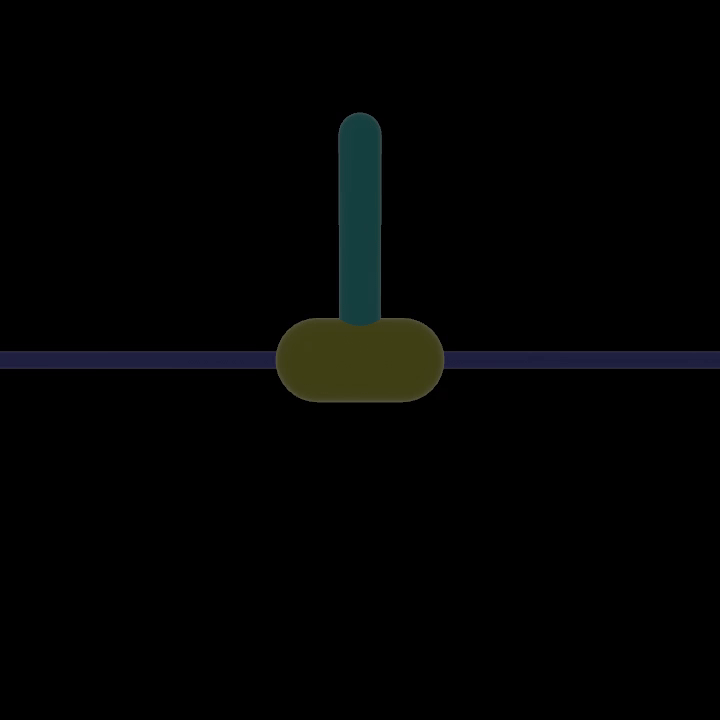

[30-second checkpoint progression](../../docs/videos/inverted-pendulum.mp4)

## InvertedDoublePendulum-v5

The approximation mirrors Gymnasium's nine observations, bounded force,
tip height termination, reward formula, 1,000-step limit, and XML geometry.
Actor pretraining uses 2,048 controller-labelled samples at actor rate `0.003`,
then leaves the Gymnasium reward unchanged for PPO. The selected Burn
checkpoint scored held-out means of `9,337.922`, `9,339.164`, and `9,153.666`
across three independent 100-episode seed schedules. Each result exceeds
Gymnasium's `9,100` registry threshold.

```sh
cargo run --no-default-features --release --example inverted-double-pendulum -- train
cargo run --release --example inverted-double-pendulum
```

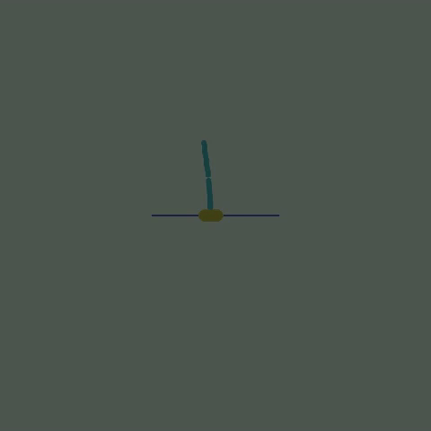

[30-second checkpoint progression](../../docs/videos/inverted-double-pendulum.mp4)

## Reacher-v5

The approximation mirrors Gymnasium's ten observations, two bounded torques,
post-step fingertip distance reward, squared-control penalty, randomized target,
50-step limit, and MuJoCo XML geometry. The policy keeps the public environment
observation but encodes its target coordinates as inverse-kinematics joint
errors before actor inference. With actor rate `0.003`, the selected checkpoint
scored held-out means of `-3.046`, `-2.813`, and `-3.171` across three
independent 100-episode seed schedules. Each result exceeds Gymnasium's `-3.75`
registry threshold.

```sh
cargo run --no-default-features --release --example reacher -- train
cargo run --release --example reacher
```

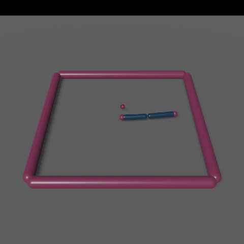

[30-second checkpoint progression](../../docs/videos/reacher.mp4)

## Pusher-v5

The approximation mirrors Gymnasium's 23 observations, seven bounded torques,
post-step object-distance, fingertip-near, and squared-control rewards,
randomized cylinder position, 100-step limit, and MuJoCo XML scene. The
controller-labelled policy uses actor rate `0.003` and reaches a 100-episode
mean of `-25.561`, compared with `-22.546` for the controller. Independent
held-out means are `-26.136`, `-26.457`, and `-25.568`.

Gymnasium publishes `0` as the registry threshold, but every reward term is
nonpositive and the randomized object begins away from the goal. A finite
episode with a nonzero transient therefore cannot equal `0`; the values above
report the measured gap to that upper bound.

```sh
cargo run --no-default-features --release --example pusher -- train
cargo run --release --example pusher
```

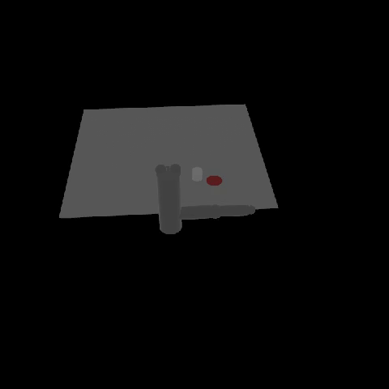

[30-second checkpoint progression](../../docs/videos/pusher.mp4)

## Swimmer-v5

The approximation mirrors Gymnasium's eight position-free observations, two
bounded rotor torques, 0.04-second step, forward-velocity reward, `1e-4`
control cost, 1,000-step limit, and three-link XML geometry. The actor uses a
phase-observable coupled gait at rate `0.003`. The selected checkpoint scored
held-out means of `439.655`, `439.547`, and `439.530` across three independent
100-episode schedules. Every episode exceeded Gymnasium's `360` registry
threshold.

```sh
cargo run --no-default-features --release --example swimmer -- train
cargo run --release --example swimmer
```

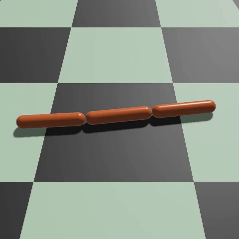

[30-second checkpoint progression](../../docs/videos/swimmer.mp4)

## Hopper-v5

The approximation mirrors Gymnasium's eleven position-free observations, three
bounded hinge torques, 0.008-second step, forward velocity, healthy reward,
`1e-3` control cost, health termination, 1,000-step limit, and four-link XML
geometry. The actor uses a phase-observable hopping gait at rate `0.003`. The
selected checkpoint scored held-out means of `5,768.647`, `5,767.402`, and
`5,768.412` across three independent 100-episode schedules. Every episode
exceeded Gymnasium's `3,800` registry threshold.

```sh
cargo run --no-default-features --release --example hopper -- train
cargo run --release --example hopper
```

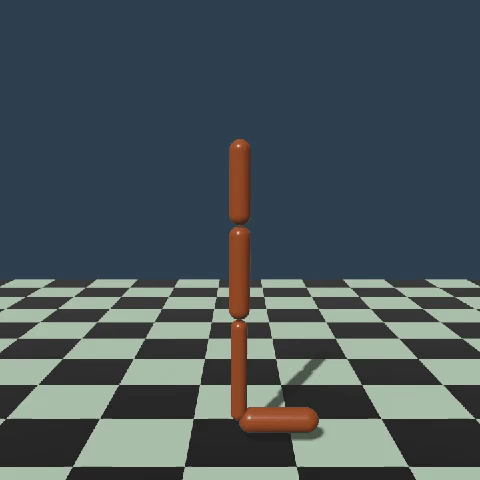

[30-second checkpoint progression](../../docs/videos/hopper.mp4)

## HalfCheetah-v5

The approximation mirrors Gymnasium's 17 position-free observations, six
bounded hinge torques, 0.05-second step, forward-velocity reward, `0.1`
control cost, nonterminating episodes, 1,000-step limit, and eight-link XML
geometry. The actor removes global velocity from its private gait encoding
while the environment retains the public observation vector. With actor rate `0.003`,
the selected checkpoint scored held-out means of `6,575.843`, `6,576.448`,
and `6,586.442` across three independent 100-episode schedules. Every episode
exceeded Gymnasium's `4,800` registry threshold.

```sh
cargo run --no-default-features --release --example half-cheetah -- train
cargo run --release --example half-cheetah
```

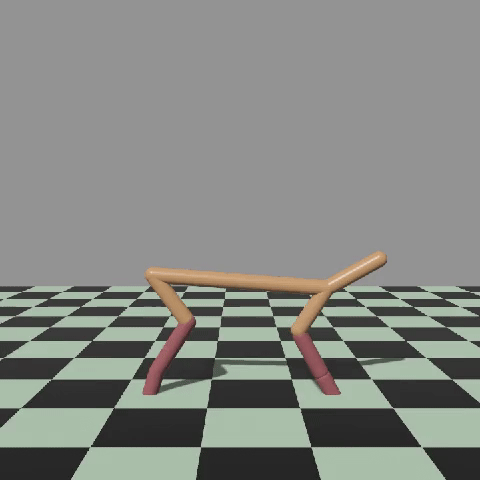

[30-second checkpoint progression](../../docs/videos/half-cheetah.mp4)

## Walker2d-v5

The approximation mirrors Gymnasium's 17 position-free observations, six
bounded hinge torques, clipped velocities, 0.008-second step, forward and
healthy rewards, `1e-3` control cost, strict health termination, 1,000-step
limit, and seven-link XML geometry. Gymnasium publishes no registry threshold.
The selected actor-rate-`0.003` checkpoint scored held-out means of `6,664.110`,
`6,663.887`, and `6,663.812` across three independent 100-episode schedules.
A deterministic random-action baseline scored `3,345.893`.

```sh
cargo run --no-default-features --release --example walker2d -- train
cargo run --release --example walker2d
```

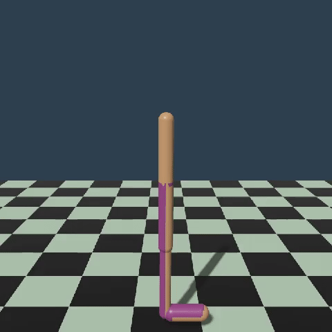

[30-second checkpoint progression](../../docs/videos/walker2d.mp4)

## Ant-v5

The approximation mirrors Gymnasium's 105 observations, eight actuator-ordered
torques, 78 clipped contact-force values, 0.05-second step, forward and healthy
rewards, control and contact costs, strict health termination, 1,000-step
limit, and four-leg XML geometry. The selected actor-rate-`0.003` checkpoint
scored held-out means of `6,384.858`, `6,440.257`, and `6,600.402` across
three independent 100-episode schedules. Each mean exceeds Gymnasium's `6,000`
registry threshold.

```sh
cargo run --no-default-features --release --example ant -- train
cargo run --release --example ant
```

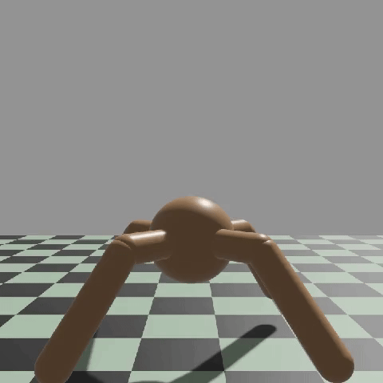

[30-second checkpoint progression](../../docs/videos/ant.mp4)

## HumanoidStandup-v5

The approximation mirrors Gymnasium's 348 observations, 17 torques in
`[-0.4, 0.4]`, inertia, center-velocity, actuator-force, and contact-force
blocks, absolute height reward using the 0.003-second model timestep, control
and impact costs, nonterminating episodes, and 1,000-step limit. Gymnasium
publishes no registry threshold. The selected actor-rate-`0.003` checkpoint
scored held-out means of `447,024.942`, `445,181.805`, and `447,484.222`.
A deterministic random-action baseline scored `122,576.090`.

```sh
cargo run --no-default-features --release --example humanoid-standup -- train
cargo run --release --example humanoid-standup
```

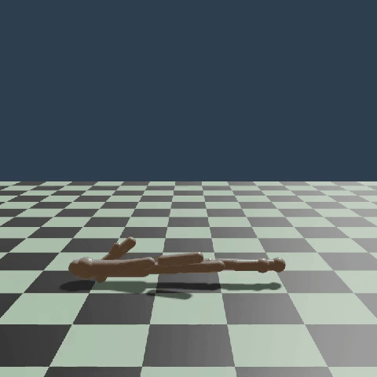

[30-second checkpoint progression](../../docs/videos/humanoid-standup.mp4)

## Humanoid-v5

The approximation mirrors Gymnasium's 348 observations, 17 torques in
`[-0.4, 0.4]`, full derived-state blocks, `1.25` forward weight, `5` healthy
reward, control and contact costs, strict `(1, 2)` height health, and
1,000-step limit. Gymnasium publishes no registry threshold. The selected
actor-rate-`0.003` checkpoint scored held-out means of `11,897.400`,
`11,902.558`, and `11,914.377`. A deterministic random-action baseline scored
`5,064.447`.

```sh
cargo run --no-default-features --release --example humanoid -- train
cargo run --release --example humanoid
```

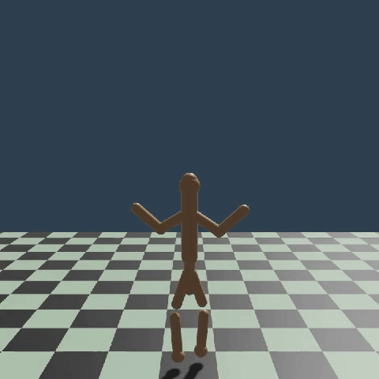

[30-second checkpoint progression](../../docs/videos/humanoid.mp4)
