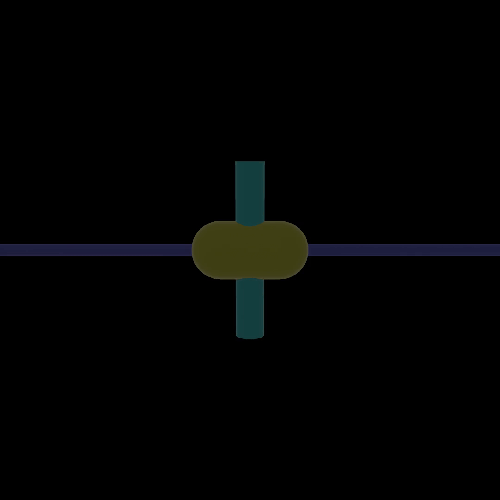
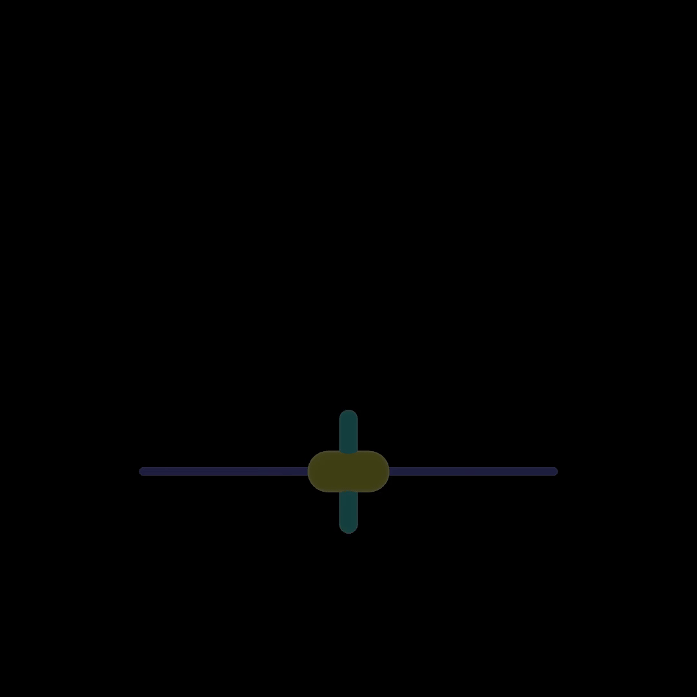
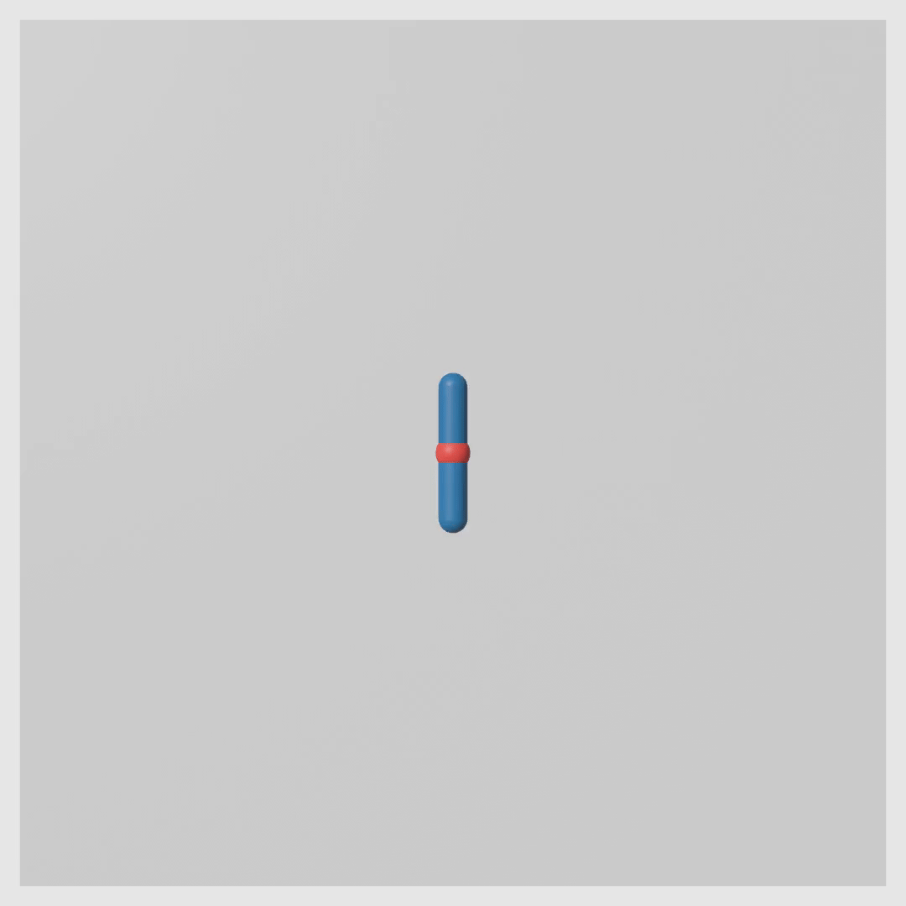

# MuJoCo

These examples run Gymnasium's original MJCF models through MuJoCo 3.9.0.
Training and evaluation are headless. Add the `render` feature for playback and
recording. The Nix development shell supplies the matching MuJoCo library.

## InvertedPendulum-v5

The recurrent PPO actor scores `1000.000` over 100 held-out seeds.
Gymnasium's registry threshold is `950`.



[30-second checkpoint progression](../../docs/videos/mujoco-inverted-pendulum.mp4)

```sh
cargo run --features mujoco --example mujoco-inverted-pendulum -- train
```

## InvertedDoublePendulum-v5

The recurrent PPO actor scores `9268.973` over 100 held-out seeds.
Gymnasium's registry threshold is `9100`.



[30-second checkpoint progression](../../docs/videos/mujoco-inverted-double-pendulum.mp4)

```sh
cargo run --features mujoco --example mujoco-inverted-double-pendulum -- train
```

## Reacher-v5

The recurrent PPO actor scores `-3.739` over 100 held-out seeds.
Gymnasium's registry threshold is `-3.75`.



[30-second checkpoint progression](../../docs/videos/mujoco-reacher.mp4)

```sh
cargo run --features mujoco --example mujoco-reacher -- train
```

Use `gif`, `video`, or `watch` after training. The `video` command selects the
available first, 33 percent, 66 percent, and best checkpoints dynamically.
