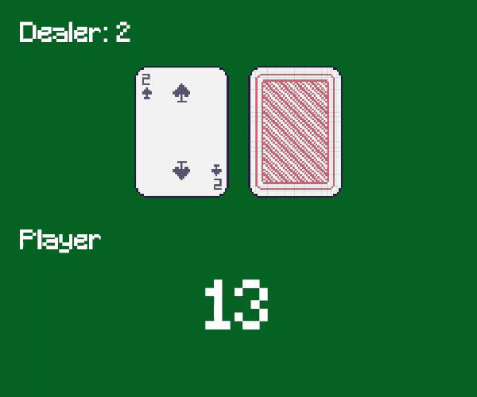
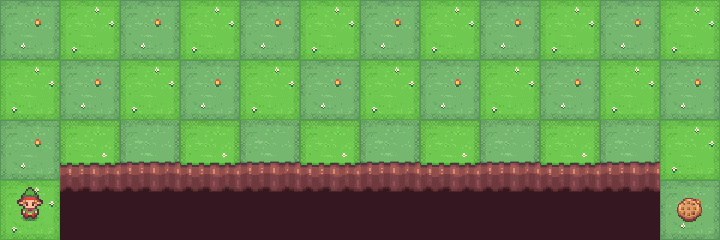
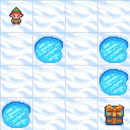
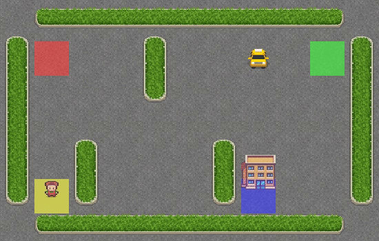

# Toy Text examples

Each example starts in visual mode by default. Use the explicit `train` command
for headless training.

## Blackjack-v1

The registered `natural=false`, `sab=true` environment uses Gymnasium's infinite
deck, ace rules, dealer policy, tuple observation, rewards, first-party card
sprites, Minecraft font, and four-frame-per-second playback. Gymnasium does not
publish a solve threshold. The selected tabular Q profile uses the first-party
tutorial's `0.01` learning rate and improved held-out mean return from about
`-0.183` to `-0.041`, `-0.043`, and `-0.045` across seeds 42, 157, and 907.

```sh
cargo run --no-default-features --release --example blackjack -- train
cargo run --release --example blackjack
```



[30-second checkpoint progression](../../docs/videos/blackjack.mp4)

## CliffWalking-v1

The default deterministic 4x12 environment uses Gymnasium's transitions,
rewards, first-party mountain sprites, and four-frame-per-second playback. The
selected tabular Q profile uses a `0.80` learning rate. It learned the exact
13-step safe route with a `-13` return after 256 training episodes for seeds 42,
157, and 907.

```sh
cargo run --no-default-features --release --example cliff-walking -- train
cargo run --release --example cliff-walking
```



[30-second checkpoint progression](../../docs/videos/cliff-walking.mp4)

## FrozenLake-v1

The slippery 4x4 environment uses Gymnasium's map, transition probabilities,
rewards, episode limit, first-party sprites, and four-frame-per-second playback.
The selected tabular Q profile uses a `0.10` learning rate and reached held-out
success rates of `0.725`, `0.725`, and `0.747` across seeds 42, 157, and 907
after 5,000 training episodes. Gymnasium's registry threshold is `0.70`.

```sh
cargo run --no-default-features --release --example frozen-lake -- train
cargo run --release --example frozen-lake
```



[30-second checkpoint progression](../../docs/videos/frozen-lake.mp4)

## Taxi-v4

The default dry and non-fickle environment uses Gymnasium's 500-state encoding,
exact road medians, action masks, transition rewards, first-party sprites, and
four-frame-per-second playback. A `0.20` learning rate reached a 100% delivery
rate and the exact shortest-path mean return of about `7.93` across all 300
possible starts. A 100-episode held-out sample reached Gymnasium's published
`8.0` threshold with an `8.14` mean return.

```sh
cargo run --no-default-features --release --example taxi -- train
cargo run --release --example taxi
```



[30-second checkpoint progression](../../docs/videos/taxi.mp4)
